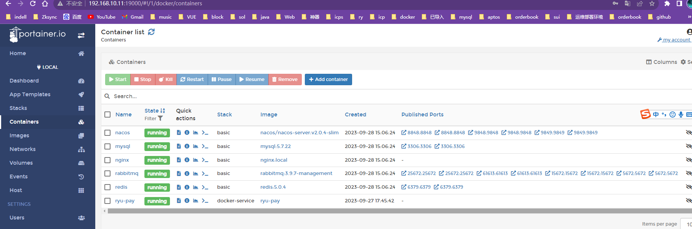
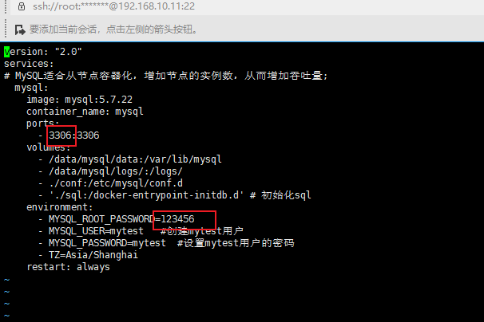

# Docker 部署教程

> 引言:  用docker compose 服务编排服务，使得一次配置后，就可以在多个不同的电脑环境下移植，从而一键部署。

## 环境准备

### docker 安装

1. 卸载旧版

   ```
   yum remove docker-ce \
          docker-ce-client \
          docker-client-latest \
          docker-common \
          docker-latest \
          docker-latest-logrotate \
          docker-logrotate \
          docker-engine
   ```

2. 安装一组工具

   ```
   yum install -y yum-utils \
       device-mapper-persistent-data \
       lvm2
   ```

3. 设置 yum 仓库地址

   ```
    yum-config-manager \
      --add-repo \
      https://download.docker.com/linux/centos/docker-ce.repo
    yum-config-manager \
      --add-repo \
      http://mirrors.aliyun.com/docker-ce/linux/centos/docker-ce.repo
   ```

4. 更新 yum 缓存

   ```
   yum makecache fast
   ```

5. 安装新版 docker

   ```
    yum install docker-ce docker-ce-cli containerd.io
   ```

6. 启动, 测试

   ```
   systemctl start docker
   ```

7. 设置 docker 开机启动

   ```
   systemctl enable docker
   ```

8. 运行 hello-world 镜像，验证 docker

   ```
   docker run hello-world
   ```

### docker compose 安装

1. 下载（建议手动下）
```
sudo curl -L "https://github.com/docker/compose/releases/download/v2.22.0/docker-compose-$(uname -s)-$(uname -m)" -o /usr/local/bin/docker-compose
```
    版本号参考 https://github.com/docker/compose/tags
> 如果是手动下载 ，去 https://github.com/docker/compose/releases/tag/v2.22.0下载[docker-compose-linux-x86_64](https://github.com/docker/compose/releases/download/v2.22.0/docker-compose-linux-x86_64)
> 然后上传到linux，在当前目录移动修改文件名
      cp   ./docker-compose-linux-x86_64  /usr/local/bin 
      mv  /usr/local/bin/docker-compose-linux-x86_64   docker-compose

2. 授权
    sudo chmod +x /usr/local/bin/docker-compose
3. docker-compose --version


## 基础服务部署

> 一键部署mysql , redis , nacos, nginx ,rabbitmq...等

- 一键部署

  进入基础服务的目录basic,运行以下命令:

  ```
  docker-compose -f master-docker-compose.yml up -d
  ```

  启动后，放行端口: 默认mysql 25003->3306,redis 25001->6379 ,rabbitMq 5672&15672,nginx 80,nacos 8848 ，如果访问不了请放行端口。

  放行端口命令:`firewall-cmd --zone=public --add-port=端口/tcp --permanent` 放行后重启防火墙`firewall-cmd --reload`

  **默认安装了可视化工具portainer,访问19000端口**



- 如果需要修改配置比如端口，密码，进入对应目录，修改配置

  比如mysql，进入对应的docker-compose.yml文件，运行`vi docker-compose.yml `修改端口和密码

  

- 对于基础服务持久化数据/日志的位置，在/data目录， `cd /data`

  

## Jar服务部署

> 首先确认nacos配置导入，确认sql的数据初始化
>
> 接下来，一键启动服务了

1. 进入主目录，下面是目录结构

   docker-service
   ├─services -- 存放jar服务
   │  ├─...  -- 具体服务的文件夹，存放jar包和配置文件 
   ├─Dockerfile  -- 通用的jar镜像构建文件 
   ├─.env             -- 环境文件
   ├─ master-docker-compose.yml   --编排启动文件

  

2. 启动所有jar服务

   docker-compose -f master-docker-compose.yml up -d

## 相关命令

- 启动所有jar服务

  docker-compose -f master-docker-compose.yml up -d

>  如果上传了新的jar包
>
> docker-compose -f master-docker-compose.yml down
>
> docker-compose -f master-docker-compose.yml up -d --build  

- 停止所有jar服务

​    docker-compose -f master-docker-componse.yml stop

- 启动某个服务

​      docker-compose -f master-docker-compose.yml up ryu-pay

> 如果上传了新的jar包
>
> docker-compose -f master-docker-compose.yml down ryu-pay
>
> docker-compose -f master-docker-compose.yml up ryu-pay --build

- 停止某个服务

​    docker-compose -f master-docker-compose.yml stop ryu-pay

- 查看某服务的日志

  docker logs  容器名

## 离线安装

在有线的环境先下载: docker pull 镜像名

- 将下载的镜像保存到归档文件: docker save -o 镜像名.tar 镜像名
- 在目标环境中加载Docker镜像: docker load -i 镜像名.tar

